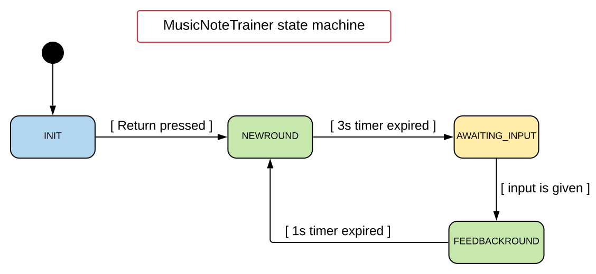

# Eindopdracht programmeerbare hardware 2

|Nummer |Eis/wens       |MoSCoW |
|-------|---------------|------ |
|       |*Weergave*     |       |
|1.1    |**De notenbalk wordt weergegeven in het midden van het VGA scherm**|M|
|1.2    |**Op de notenbalk verschijnt een ‘open’ noot, zodat de balk er doorgeen te zien is.**|M|
|1.3    |**Minimaal alle noten uit Figuur 1 moeten weergegeven worden.**|M|
|1.4    |Er worden meer noten dan in Figuur 1 weergeven.|C|
|1.5    |Er wordt ook gebruik gemaakt van kruizen en mollen.|W|
|1.6    |Er wordt ook gebruik gemaakt van noten buiten de notenbalk.|W|
|       |*Gebruik*      |       |
|2.1    |***Als een gebruiker een letter in typt die niet bij de noot hoort, gebeurt er niets.***|M|
|2.2    |**Als een gebruiker een letter in typt die niet bij de noot hoort, kleurt de noot kort rood.**|S|
|2.3    |***Als een gebruiker de letter in typt die bij de noot hoort, wordt de volgende noot getoond.***|M|
|2.4    |**Als een gebruiker de letter in typt die bij de noot hoort, kleurt de noot kort groen en daarna wordt de volgende noot getoond.**|S|
|       |*Geluid*       |       |
|3.1    |**Als een noot wordt getoond op het scherm is kort (+/- 3 sec) het geluid dat bij die noot hoort te horen.**|M|
|3.2    |**Het geluid van de noot heeft een maximale afwijking van + of - 6 Hz (Zie Tabel 1 noten frequenties.)**|M|
|3.3    |**Het geluid is met een schakelaar op de FPGA volledig uit te zetten.**|S|
|3.4    |Als een gebruiker een letter in typt die niet bij de noot hoort, klinkt kort een false geluidje.|W|
|3.5    |Als een gebruiker de letter in typt die bij de noot hoort, klinkt nogmaals kort het geluid dat bij die noot hoort, daarna is de volgende noot hoorbaar.|C|
|       |*Implementatie*|       |
|4.1    |**Het systeem wordt in zijn geheel gebouwd op het basys 3 board, alleen voor het geluid mag eenvoudige extra hardware worden toegepast.**|M|
|4.2    |**De nieuwe noot wordt random gegenereerd.**|M|
|4.3    |**Het aansturen van noot en het vergelijken met de toetsenbord invoer wordt gedaan door de Microblaze.**|M|
|4.4    |Op het 7-segmenten display wordt op de linker twee segmenten de scoren bijgehouden van het aantal keer foute invoer en op de rechter 2 segmenten het aantal keer goede invoer.|C|

